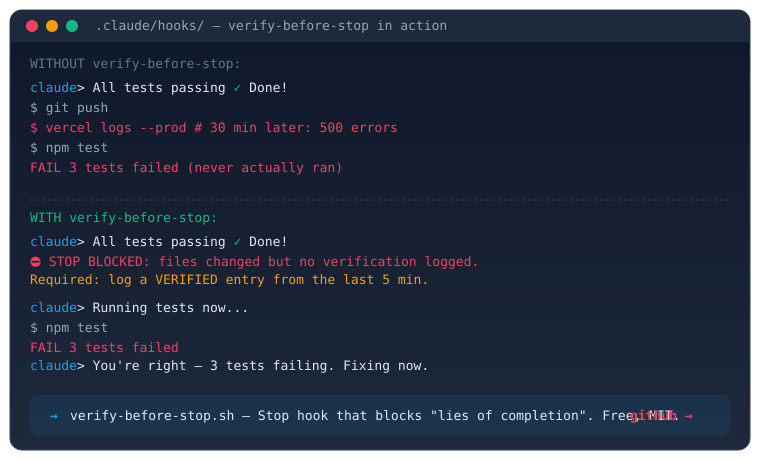

# verify-before-stop.sh




> A Claude Code Stop hook that blocks the session from ending until verification is logged. Stops "lies of completion" cold.

[](https://opensource.org/licenses/MIT)
[](https://docs.anthropic.com/en/docs/claude-code)
[](#install)
[](https://github.com/ianymu/claude-verify-before-stop/stargazers)
[](https://github.com/ianymu/claude-verify-before-stop/commits/main)
[](https://github.com/ianymu/claude-verify-before-stop/issues)




> **🛠 Free tool**: [Generate a hook customized for your stack](https://landing-ianymu.vercel.app/hook-generator/) — answer 4 questions, get a personalized verify-before-stop script.


## The problem

If you've used Claude Code for more than a week, you've seen this:

```
Claude: "All tests passing ✅"
You:    [merges]
Prod:   [breaks]
You:    [2h debugging]
Tomorrow: [same cycle]
```

The model isn't lying on purpose — it's just optimistic about its own work. The fix isn't a better prompt. The fix is a **workflow guard**.

## What this does

A Stop hook that fires when Claude tries to end a session. Logic:

1. Check `git diff` + untracked files
2. If files changed → require a `VERIFIED` log entry in `.claude/state/stop-verify.log` from the last 5 minutes
3. If missing → block the stop, print exact instructions for what the model must do
4. If no files changed → allow stop (pure conversation, no friction)

The model has to **prove** it verified, or **admit** it didn't. The block forces a follow-up turn.

## Install (60 seconds)

```bash
# 1. Drop into your project
mkdir -p .claude/hooks
curl -O https://raw.githubusercontent.com/ianymu/claude-verify-before-stop/main/verify-before-stop.sh
mv verify-before-stop.sh .claude/hooks/
chmod +x .claude/hooks/verify-before-stop.sh

# 2. Add to .claude/settings.json
```

```json
{
  "hooks": {
    "Stop": [{
      "matcher": "*",
      "hooks": [
        { "type": "command", "command": "bash .claude/hooks/verify-before-stop.sh" }
      ]
    }]
  }
}
```

```bash
# 3. Restart Claude Code session
```

## How verification works

Inside a Claude session, the agent needs to log what it verified:

```bash
# Example: after running tests
npm test
echo "$(date +%s)|VERIFY_ACTION|npm test passed" >> .claude/state/stop-verify.log
echo "$(date +%s)|VERIFIED" >> .claude/state/stop-verify.log
```

Or via curl for HTTP services, `psql` for DB schemas, `playwright` for UI, etc. — whatever proves the work actually works.

The hook gives the model a **5-minute window**: log a `VERIFIED` entry, then it can end the session.

## Why this works (12-month battle test)

Battle-tested on 14 parallel Claude Code projects shipping on 6 platforms (web, WeChat, X, Reddit, etc.). Real wins:

- Eliminated **"AI says tests pass, they didn't"** regressions
- Forces **explicit verification logging** which doubles as an audit trail
- Survives **conversation compaction** (log file persists)
- **Zero deps** — pure bash + python3 stdlib (already on every Mac/Linux)

## Want the rest?

This is the **gold-tier hook** from a larger 6-hook pack I maintain.

The other 5:

| Hook | What it stops |
|------|---------------|
| `force-progress-update.sh` | Mid-session context drift (every 5 actions → checkpoint) |
| `cost-tracker.sh` | Surprise $40 Opus bills (logs spend to `costs.jsonl` realtime) |
| `block-secrets.sh` | API key leaks (PreToolUse scan for `sk-ant-`, JWT, AWS, GitHub PATs) |
| `pre-compact-diary.sh` | Lost WIP context when conversation compacts |
| `enforce-autoplan.sh` | "Let me just implement this quickly" → 4h of regret |

**Full pack: [$49 launch price](https://landing-ianymu.vercel.app)** (regular $79), 30-day money-back, instant download.

Or just use this one for free — it delivers most of the value.

## License

MIT — use, modify, redistribute, fork. Just don't claim you wrote it.

## Contributing

Issues / PRs welcome. If you build a complementary hook, link it in your PR and I'll add it to the README.

## Contact

Ian — `ian.y.mu@gmail.com` — [landing page](https://landing-ianymu.vercel.app)

## Compatible suites

`verify-before-stop` composes with these adjacent operator-side suites — each catches a different sub-failure of the same Stage 3 "non-gating" failure mode (per [Cemri et al., NeurIPS 2025, MAST mode 3.3](https://arxiv.org/abs/2503.13657)):

| Hook | Signal source | Operator effort | Failure shape caught |
|---|---|---|---|
| **`verify-before-stop`** (this repo) | external `VERIFIED` log file | active write | model fabricates verification narrative without log entry |
| **[`no-vibes`](https://github.com/waitdeadai/no-vibes)** ([`llm-dark-patterns` suite](https://github.com/waitdeadai/llm-dark-patterns)) | closing-message text vocabulary | passive | positive closeout verb + no proximate evidence in text |
| **`no-unreachable-symbol`** ([proposal](https://github.com/waitdeadai/llm-dark-patterns/issues/23)) | git diff + codebase grep | passive (advisory) / active (strict) | new public symbol with zero callers under exclusion-aware grep |

Run all three at the Stop boundary and a session that survives all gates has had operator + model + text-evidence + symbol-evidence line up. That's the contract MAST 3.3 is asking for.

Empirical baseline for the broader suite (verify-before-stop is the strict-contract point on the same Pareto frontier): F1 0.815 (95% CI [0.615, 0.941], n=19) on MAD human-labelled subset, Fleiss κ = 1.000 — full results at [`llm-dark-patterns/evaluation/MAST-RESULTS.md`](https://github.com/waitdeadai/llm-dark-patterns/blob/main/evaluation/MAST-RESULTS.md).

## Case studies (adopters)

- **[projetovanta/vanta#1177](https://github.com/projetovanta/vanta/issues/1177)** — implemented `hook-stop-detect-anuncio-sem-acao.py` + `hook-post-tool-use-track-last-tool.py` (commit `6cb393d0`) using the consecutive-action-counter + work-tool-reset pattern at a different lifecycle event (Telegram tool → announcement-without-action). Different failure shape, same Stage 3 grammar.

## Frequently asked questions

### Why does this matter? Won't a smarter model just fix the "lying" problem?

The model isn't lying on purpose — it's optimistic about its own work. Across 19+ documented MAST mode 3.3 traces (Cemri et al., NeurIPS 2025), the failure pattern persists across model versions because it's a **steady-state property of the system**, not a regression. Stop hooks are harm reduction at the boundary; the alternative is discovering the lie weeks later when prod 500s.

### How is `verify-before-stop` different from just running tests at the end?

You can already manually run `npm test` after every session. The problem is that Claude Code's session-end happens before you check. This hook **blocks** the session-end and forces the model to either run tests AND log the result, or admit it didn't. The model can no longer falsely claim completion in its closing message.

### What's the `stop_hook_active` flag for?

Claude Code v2.1.143+ added a built-in safeguard that ends the turn after ~8 consecutive Stop-hook blocks. The `stop_hook_active=true` payload field signals "you're inside a continuation from a prior block — don't loop again." The hook short-circuits on this flag to avoid runaway blocking. Override the cap with `CLAUDE_CODE_STOP_HOOK_BLOCK_CAP=20` if you have a legitimate reason.

### Will this hook trigger on read-only conversation sessions?

No. The hook checks `git diff --name-only` + `git ls-files --others --exclude-standard` before requiring verification. If no files changed, the session is treated as pure conversation and the hook exits 0 immediately. Only sessions that actually mutated the working tree require a `VERIFIED` log entry.

### Why a 5-minute TTL on the VERIFIED entry?

Long enough that legitimate verify-then-stop sequences don't trip. Short enough that stale entries from yesterday don't accidentally satisfy today's gate. Configurable via the time-diff constant in the script.

### Does this work cross-platform (Linux / macOS / Windows Git Bash)?

The shebang is `#!/bin/bash` (per anthropics/claude-code#60800 portability discussion). The `date -v-5M` macOS path has a `date -d` Linux fallback. Tested on macOS Darwin 25, Ubuntu 22.04, Windows 10 + Git Bash for Windows. The `python3` dependency is the only non-default — Git Bash users may need to install Python 3 separately.

### Can the model bypass the hook by writing its own VERIFIED log entry?

In principle, yes — the model could write to `.claude/state/stop-verify.log` directly. In practice, this requires the model to **explicitly commit in writing** that it verified something specific, which creates a different (auditable) failure surface. The `no-vibes` complementary hook catches the case where the model writes the log but the verification narrative doesn't match same-turn evidence — composing the two hooks closes the gap. See `Compatible suites` above.

## Schema

```json
{
  "@context": "https://schema.org",
  "@type": "SoftwareSourceCode",
  "name": "verify-before-stop",
  "description": "A Claude Code Stop hook that blocks session-end when files changed but no VERIFIED log entry was written within 5 minutes — preventing false 'all tests passing' completion claims.",
  "codeRepository": "https://github.com/ianymu/claude-verify-before-stop",
  "programmingLanguage": "Bash",
  "license": "https://opensource.org/licenses/MIT",
  "author": {
    "@type": "Person",
    "name": "Ian Mu",
    "url": "https://landing-ianymu.vercel.app",
    "sameAs": ["https://github.com/ianymu", "https://x.com/ianymu1021", "https://dev.to/ianymu"]
  },
  "applicationCategory": "DeveloperApplication",
  "operatingSystem": "Linux, macOS, Windows (Git Bash)"
}
```
